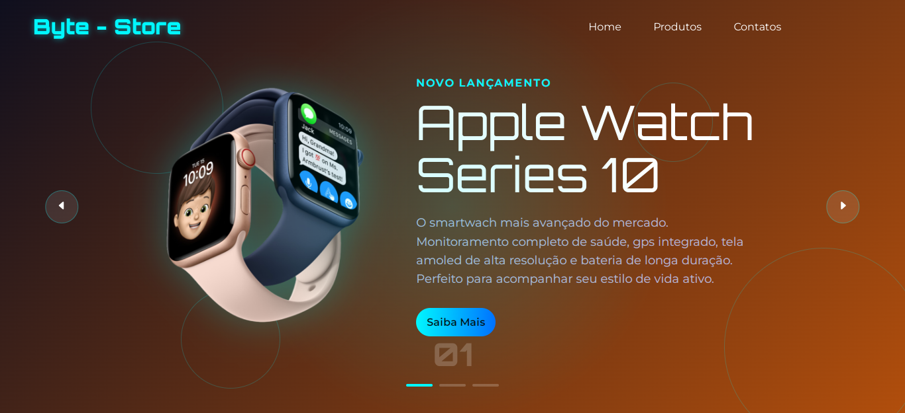

🛍️ Byte Store
Loja virtual de produtos de tecnologia, desenvolvida utilizando HTML, CSS e JavaScript. Este projeto simula uma vitrine digital, 
com destaque para um carrossel de produtos que permite visualizar diferentes lançamentos diretamente na mesma página, de forma interativa e responsiva. 

  

🔥 Funcionalidades

✅ Página única com navegação simples e objetiva.

✅ Slide de produtos dinâmico, sem recarregar a página.

✅ Design moderno com visual futurista e atraente.

✅ Layout responsivo, adaptável a diferentes tamanhos de tela.

✅ Efeitos de hover, animações e transições suaves.

  🛠️ Tecnologias Utilizadas:
  
        🌐 HTML5 – Estrutura da página
      
        🎨 CSS3 – Estilização e responsividade
      
        ⚙️ JavaScript – Funcionalidade do carrossel e interações
      
        📸 Layout

  🚀 Acesso ao Projeto

        👉 Acesse o projeto online
        👉 Ou clone o repositório:

🧠 Aprendizados

        Durante o desenvolvimento desse projeto, foram aplicados conceitos como:
        
        Manipulação de DOM com JavaScript puro.
        
        Desenvolvimento de um slider/carrossel de produtos manualmente.
        
        Aplicação de conceitos de design responsivo.
        
        Criação de animações CSS e transições para melhorar a experiência do usuário.

🙌 Contribuições
        Sinta-se à vontade para enviar sugestões, melhorias ou relatar problemas via Issues ou pull requests.

👨‍💻 Desenvolvedor
                Leonel Chagas Leite
                💼 LinkedIn
                📱 (51) 99117-0444
                🚀 GitHub

📄 Licença
Este projeto está sob a licença MIT. Consulte o arquivo LICENSE para mais informações.
